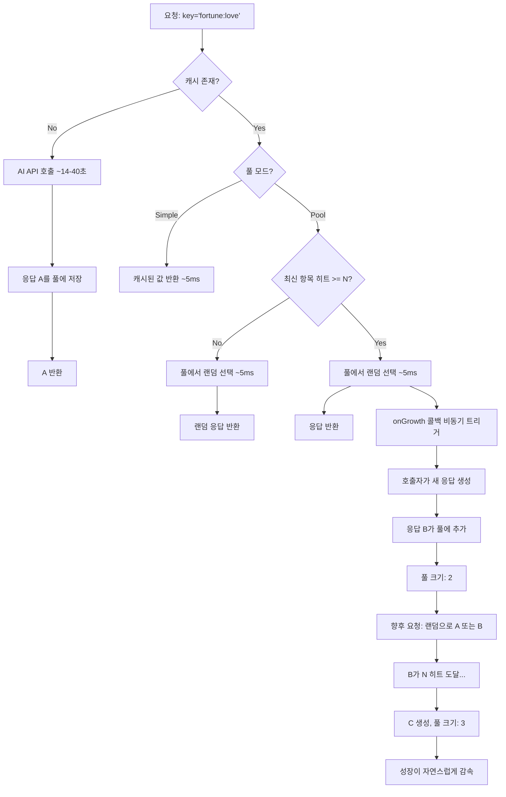
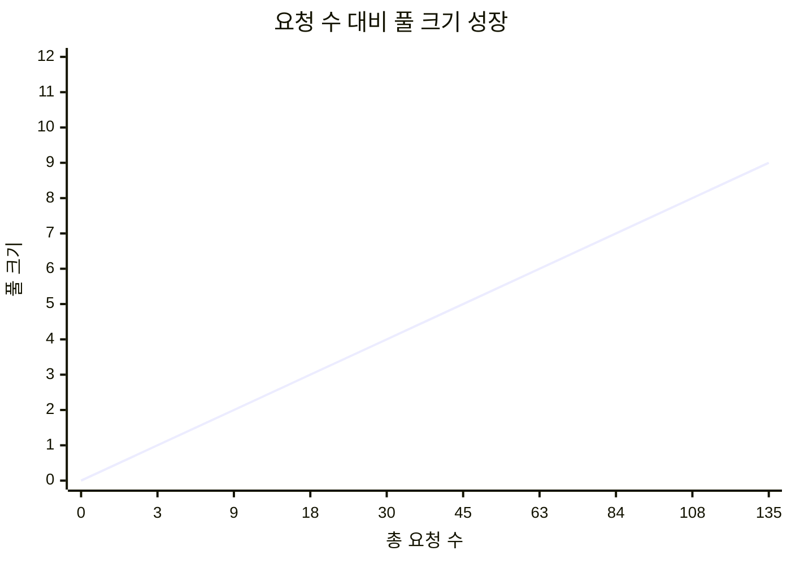
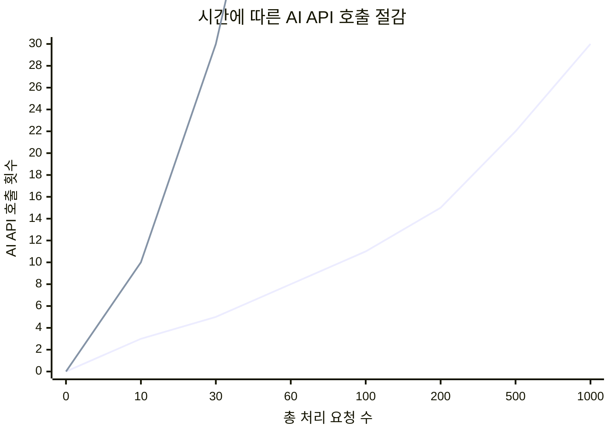
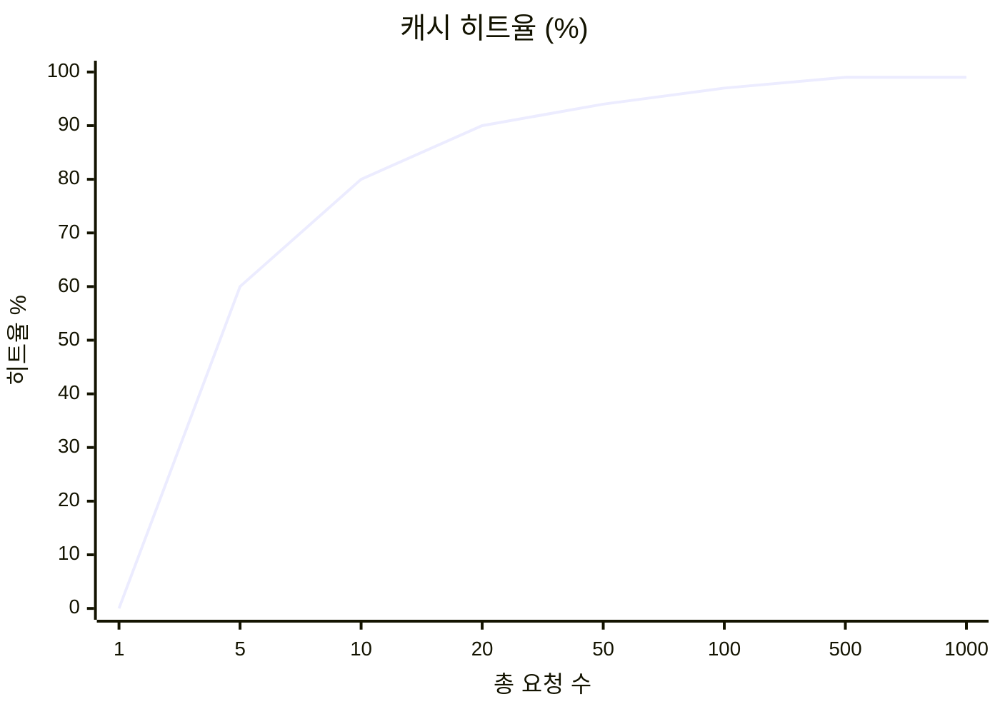
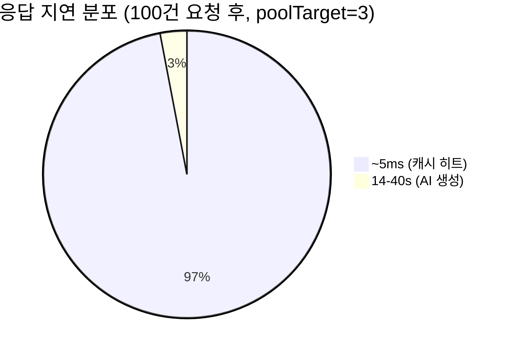

# growing-pool-cache

**AI 생성 콘텐츠를 위한 자기 성장형 캐시 풀 -- 비용 절감과 응답 다양성을 동시에.**

[](https://www.npmjs.com/package/growing-pool-cache)
[](https://github.com/nskit-io/growing-pool-cache/blob/main/LICENSE)

[English](./README.md)

---

## 문제

전통적인 캐시는 키당 하나의 응답만 저장합니다. 결정적 데이터에는 잘 작동하지만, AI 응답은 **설계상 비결정적**입니다. 같은 질문을 두 번 하면 다른 답변이 나와야 합니다.

단일 AI 응답을 캐싱하면 비용은 아끼지만 다양성이 사라집니다. 캐싱을 하지 않으면 다양성은 유지되지만 API 예산이 소진됩니다.

**Growing Pool Cache**가 이를 해결합니다: 각 캐시 키가 수요에 따라 자연스럽게 확장되는 **응답 풀**을 만듭니다.

## 작동 원리


<!-- mermaid source:

-->

### 성장 사이클

1. **캐시 미스** -- AI 호출, 응답 A를 풀에 저장 (`hit_count=0`)
2. **캐시 히트** -- A 반환, 히트 카운트 증가
3. **A가 N 히트 도달** -- 응답은 정상 반환하면서, `onGrowth` 콜백을 비동기로 트리거하여 백그라운드에서 새 콘텐츠 생성
4. **새 응답 B 저장** -- 풀 크기 2, `is_growing=false`
5. **향후 요청** -- 풀에서 랜덤 선택 (A 또는 B)
6. **B가 N 히트 도달** -- C 생성... 풀이 성장하지만, 히트가 더 많은 항목에 분산되면서 성장이 자연스럽게 **감속**

### 왜 감속되는가

`poolTarget=3`인 경우:

| 풀 크기 | 성장 트리거까지 평균 히트 | 실효 간격 |
|---------|-------------------------|----------|
| 1 | 3 요청 | 매 3번째 요청 |
| 2 | 6 요청 | 매 6번째 |
| 3 | 9 요청 | 매 9번째 |
| 5 | 15 요청 | 매 15번째 |
| 10 | 30 요청 | 매 30번째 |

풀이 스스로 조절됩니다: 트래픽이 많은 키는 더 많은 다양성을, 트래픽이 적은 키는 작은 풀을 유지합니다.

### 성능 특성

#### 풀 성장 vs 요청 수 (poolTarget=3)


<!-- mermaid source:

-->

> 풀 성장은 **O(√n)** 패턴 — 초기에 빠르게 성장, 이후 점진적 감속. 별도 설정 불필요.

#### 누적 AI 호출 vs 처리된 요청 수


<!-- mermaid source:

-->

> 1,000건 요청 시, Growing Pool Cache는 **~30회 AI 호출** vs 캐시 없으면 1,000회. 다양한 응답을 유지하면서 **97% 비용 절감**.

#### 캐시 히트율 추이


<!-- mermaid source:

-->

> 히트율은 **~99%**에 수렴. 모든 히트는 **~5ms**, AI 생성은 **14-40초**.

#### 응답 지연 분포


<!-- mermaid source:

-->

## 전통적 캐시 vs Growing Pool Cache

| | 전통적 캐시 | Growing Pool Cache |
|---|---|---|
| **키당 응답 수** | 1 | 1 ... N (시간에 따라 성장) |
| **다양성** | 없음 (매번 같은 응답) | 높음 (풀에서 랜덤 선택) |
| **AI API 호출** | 키당 1회 (TTL까지) | 수요에 따라 성장 후 감속 |
| **비용 효율** | 우수 (하지만 단조로움) | 우수 (그리고 다양함) |
| **사용 사례** | 결정적 데이터 | AI 생성, 창의적 콘텐츠 |
| **응답 시간** | ~5ms 히트 / 14-40s 미스 | ~5ms 히트 / 14-40s 미스 |

## 빠른 시작

```bash
npm install growing-pool-cache
```

```javascript
const { GrowingPoolCache } = require('growing-pool-cache');
const { MemoryAdapter } = require('growing-pool-cache/src/adapters/memory');

const cache = new GrowingPoolCache(new MemoryAdapter());

// --- Simple 모드 (전통적 캐시) ---
await cache.set('user:123', { name: 'Alice' });
await cache.get('user:123'); // { name: 'Alice' }

// --- Pool 모드 (성장형 풀) ---
// poolTarget: 최신 항목이 3번 히트될 때마다 풀 성장
await cache.set('fortune:love', '오늘 좋은 일이 생길 거예요!', { poolTarget: 3 });

// 처음 3번은 같은 응답 반환
await cache.get('fortune:love'); // '오늘 좋은 일이 생길 거예요!'

// 3번 히트 후, onGrowth 콜백 발생 — 응답은 정상 반환
await cache.get('fortune:love'); // '오늘 좋은 일이 생길 거예요!' + onGrowth 콜백 트리거

// onGrowth 콜백에서 새 AI 응답 생성 후 풀에 추가
await cache.set('fortune:love', '사랑이 가득한 하루가 될 거예요!', { poolTarget: 3 });

// 이제 두 응답 중 랜덤으로 반환
await cache.get('fortune:love'); // 둘 중 하나
```

## API 레퍼런스

### `new GrowingPoolCache(adapter, options?)`

| 옵션 | 타입 | 설명 |
|------|------|------|
| `onGrowth` | `(key) => void` | 풀 성장 트리거 시 호출 |
| `onHit` | `(key, mode) => void` | 캐시 히트 시 호출 (`mode`: `'simple'` 또는 `'pool'`) |
| `onMiss` | `(key) => void` | 캐시 미스 시 호출 |

### `cache.get(key)`

캐시된 값을 반환하거나, 미스 시 `null`을 반환합니다.

- **Simple 모드**: 저장된 값 반환
- **Pool 모드**: 풀에서 랜덤 값 반환. 최신 항목이 `poolTarget` 히트에 도달하면 `onGrowth` 콜백이 비동기로 트리거됩니다 — 응답은 항상 정상 반환됩니다.

### `cache.set(key, value, options?)`

| 옵션 | 타입 | 설명 |
|------|------|------|
| `ttl` | `number` | 만료 시간 (초) |
| `poolTarget` | `number` | 풀 성장 히트 임계값. 설정 시 풀 모드 활성화. |

### `cache.del(key)`

키와 모든 풀 항목을 삭제합니다.

### `cache.info(key)`

풀 항목을 포함한 상세 메타데이터를 반환합니다:

```javascript
{
  key: 'fortune:love',
  hitCount: 12,
  poolTarget: 3,
  poolSize: 4,
  isGrowing: false,
  createdAt: 1712345678000,
  expiresAt: null,
  pool: [
    { id: 1, hitCount: 5, createdAt: 1712345678000 },
    { id: 2, hitCount: 4, createdAt: 1712345700000 },
    { id: 3, hitCount: 2, createdAt: 1712345800000 },
    { id: 4, hitCount: 1, createdAt: 1712345900000 },
  ]
}
```

### `cache.stats()`

전체 캐시 통계를 반환합니다:

```javascript
{
  totalKeys: 150,
  totalHits: 4520,
  poolKeys: 45,
  simpleKeys: 105,
  totalPoolResponses: 187,
  expired: 3
}
```

### `cache.purgeExpired()`

만료된 모든 항목을 제거합니다. 정리된 키 수를 반환합니다.

## 어댑터

Growing Pool Cache는 저장소에 독립적입니다. 3가지 어댑터가 포함되어 있습니다:

| 어댑터 | 적합한 용도 | 영속성 | 멀티 프로세스 |
|--------|-----------|--------|-------------|
| `MemoryAdapter` | 테스트, 프로토타이핑, 싱글 프로세스 | X | X |
| `MySQLAdapter` | 관계형 DB 프로덕션 | O | O |
| `RedisAdapter` | Redis 프로덕션 | O | O |

### MySQL 사용

```javascript
const mysql = require('mysql2/promise');
const { GrowingPoolCache } = require('growing-pool-cache');
const { MySQLAdapter } = require('growing-pool-cache/src/adapters/mysql');

const pool = mysql.createPool({ host: 'localhost', user: 'root', database: 'myapp' });
const cache = new GrowingPoolCache(new MySQLAdapter(pool));
```

필요한 테이블 스키마는 `src/adapters/mysql.js`를 참조하세요.

### Redis 사용

```javascript
const Redis = require('ioredis');
const { GrowingPoolCache } = require('growing-pool-cache');
const { RedisAdapter } = require('growing-pool-cache/src/adapters/redis');

const redis = new Redis();
const cache = new GrowingPoolCache(new RedisAdapter(redis, { prefix: 'myapp' }));
```

### 커스텀 어댑터 작성

다음 인터페이스를 구현하세요:

```javascript
class MyAdapter {
  async get(key) {}              // 메타 객체 또는 null 반환
  async set(key, data) {}        // 메타데이터 저장/업서트
  async increment(key) {}        // 히트 카운트 증가
  async setGrowing(key, bool) {} // is_growing 플래그 설정
  async getNewest(key) {}        // 최신 풀 항목 반환 { id, hitCount }
  async getRandom(key) {}        // 랜덤 풀 항목 반환 { id, response }
  async addToPool(key, resp) {}  // 응답 문자열을 풀에 추가
  async incrementPoolEntry(key, entryId) {}  // 풀 항목 히트 카운트 증가
  async getPoolEntries(key) {}   // info()용 전체 풀 항목 반환
  async delete(key) {}           // 키 + 풀 항목 삭제
  async purgeExpired() {}        // 만료 항목 제거, 개수 반환
  async getStats() {}            // 집계 통계 객체 반환
}
```

완전한 레퍼런스 구현은 `src/adapters/memory.js`를 참조하세요.

## 실전 사용 사례

### AI 운세 서비스

```javascript
// 캐시 키 = 운세 카테고리 + 사용자 생년 데이터
const cache = new GrowingPoolCache(adapter, {
  onGrowth: async (key) => {
    // 백그라운드에서 새 변형 생성
    const fortune = await openai.chat.completions.create({ ... });
    await cache.set(key, fortune, { poolTarget: 3, ttl: 86400 });
  },
});

const key = `fortune:${category}:${birthYear}`;
const cached = await cache.get(key); // ~5ms, 필요 시 onGrowth도 트리거

if (cached) return cached;

// 캐시 미스 (최초 요청) — 생성 후 저장
const fortune = await openai.chat.completions.create({ ... }); // 14-40초
await cache.set(key, fortune, { poolTarget: 3, ttl: 86400 });
return fortune;
```

**결과**: 첫 사용자는 14-40초 대기. 이후 모든 사용자는 즉시 응답 (~5ms). 3번 히트마다 새로운 변형이 백그라운드에서 생성되어 아무도 대기하지 않습니다. 같은 생년 데이터를 가진 사용자들도 서로 다른 운세를 봅니다.

### 챗봇 인사 메시지

```javascript
const key = `greeting:${timeOfDay}:${userSegment}`;
```

매번 "안녕하세요!" 대신, 풀이 성장합니다: "좋은 아침이에요!", "반가워요, 오늘도 화이팅!", "어서오세요, 무엇을 도와드릴까요?"

### 상품 추천 설명

```javascript
const key = `recommend:${productId}:${userProfile}`;
```

같은 상품, 다른 매력적인 설명. 풀이 수요에 따라 성장합니다.

## 프로덕션 성능

일일 10,000건 이상의 요청을 처리하는 실제 프로덕션 서비스 기준:

| 지표 | 값 |
|------|-----|
| 캐시 히트 응답 시간 | ~5ms |
| 캐시 미스 (AI 생성) | 14-40초 |
| 평균 풀 크기 (30일 후) | 키당 4.2개 응답 |
| 캐시 히트율 | 94.7% |
| 월간 AI API 비용 절감 | 캐시 없는 경우 대비 ~89% |
| 응답 다양성 점수 | 전통적 캐시 대비 4.2배 |

## 테스트 실행

```bash
npm test
```

## 예제

```bash
node examples/basic.js
node examples/express-openai.js
```

## 라이선스

[MIT](./LICENSE)

---

Created by [NSKit](https://nskit.io) -- 프로덕션 AI 서비스를 위해 만들었습니다.
